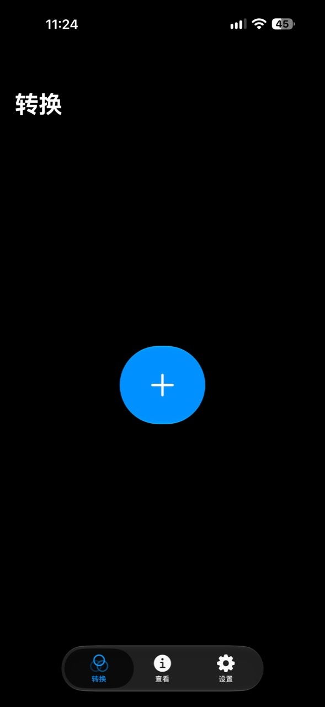
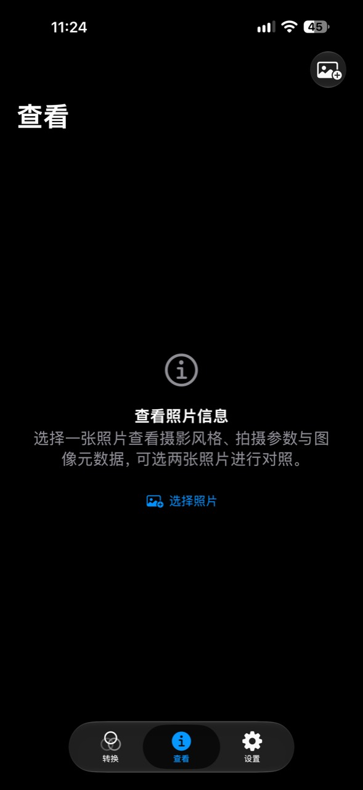
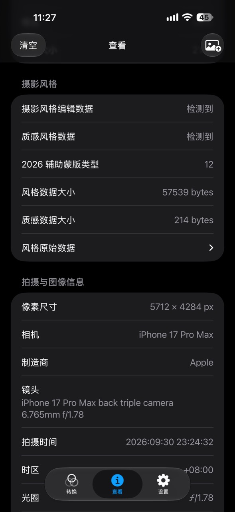

# 过片 · StylePort

这是一个可以让支持 摄影风格2 的手机（比如 iPhone 17 系列）拍摄的照片也能支持 摄影风格3 的小工具。

StylePort is an iOS tool that adds Photographic Styles 3 editing data to compatible HEIC photos captured with Photographic Styles 2, including iPhone 17 photos, and lets you inspect and compare photo metadata.

目前仅在 iPhone 17 Pro Max 上测试。

## 软件截图

  
  
  

## 更新日志

### 0.0.2

- 支持转换 Live Photo，并保留实况效果。
- 修复转换后的 Live Photo 在系统照片中编辑或完成保存时可能导致照片 App 退出的问题。
- 改进批量转换、分享和快捷指令对 Live Photo 的导入与错误提示。

## 使用方法

导入照片后点击「转换」，就可以把那些只支持 摄影风格2 的照片，转换成可以支持 摄影风格3 的照片了。
支持批量处理，也可从系统分享面板或快捷指令传入照片。

默认保存副本，保留原文件名并追加 `_GP`，例如 `IMG_0001_GP.HEIC`。转换对象需要包含可编辑摄影风格和 HDR tone-map 数据；不支持或已包含目标风格数据的照片会自动跳过。

## 查看功能

选择一张照片，查看摄影风格数据、辅助蒙版、相机与镜头、曝光参数、图像尺寸、色彩信息及原始元数据。选择两张照片，可对照元数据差异、文件大小和主图编码数据。

## 实现原理

直接修改 HEIC 容器：

1. 解析 `meta` 中的图像项目、属性、引用和数据位置，保留原有主图编码、EXIF 与摄影风格数据。
2. 从内置模板读取质感风格数据 `texture_styles`，追加 12 组占位辅助蒙版及其 XMP，共新增 25 个项目。占位蒙版是模板数据，未对原图重新进行语义分割。
3. 更新 `iinf`、`iprp`、`iref`、`iloc`，建立新增项目与主图、HDR tone-map 的关联，调整数据偏移并扩展 `mdat`。
4. 使用 ImageIO 检查输出可读取，并验证目标风格数据标识，然后保存至系统照片库。

查看功能使用 ImageIO 读取图像属性，解析 HEIC 中的风格载荷与辅助图像标识。

## 安装方式

直接下载 releases 里面的 ipa 文件，然后自签安装，自签教程请自行寻找。

## 许可证

源代码和文档采用 [Apache-2.0](LICENSE)。
